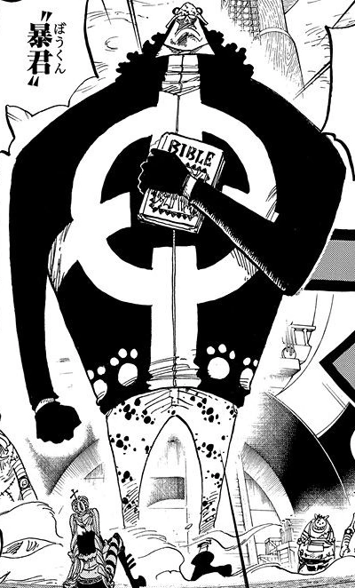

# kuma

# todo
- [ ] collect binance data to stream
- [ ] collect uniswap data to stream
- [ ] save binance data to db
- [ ] save uniswap data to db
- [ ] detect arbs
- [ ] set up alerts for arbs
- [ ] execute both directions of an arb

# resources
[excalidraw link](https://excalidraw.com/#room=ca67da2b51930cc17ca7,lfzj6eSMJd40Hcf9WTaJpg)

## ethereum
[geth json rpc docs](https://geth.ethereum.org/docs/interacting-with-geth/rpc)

### uniswap
[univ3 sdk](https://docs.uniswap.org/sdk/v3/overview)
[univ3 math](https://www.desmos.com/calculator/q2kxfue441)
[univ3 math rs](https://github.com/0xKitsune/uniswap-v3-math)
[`uniswap-v3-sdk-rs`](https://github.com/shuhuiluo/uniswap-v3-sdk-rs)

## rust
`binance-rs`:
- [docs](https://docs.rs/binance/0.21.0/binance/index.html)
- [repo](https://github.com/wisespace-io/binance-rs/tree/master)

[penumbra-zone/osiris](https://github.com/penumbra-zone/osiris/tree/main)

## binance
[binance api docs](https://developers.binance.com/docs/binance-spot-api-docs/web-socket-streams)
