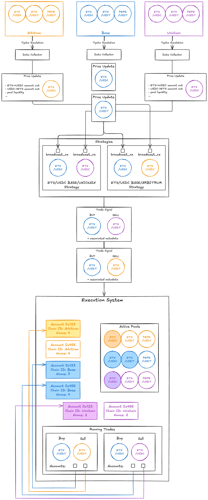

# Kuma — Cross-Chain Arbitrage Bot

Kuma is an automated cross-chain arbitrage bot that exploits price discrepancies in AMM pools across EVM-compatible blockchains. It monitors DEX pool states in real time, identifies profitable arbitrage opportunities, and executes two-legged trades sequentially to capture the surplus.

## How it works

1. **Ingest** — Real-time DEX pool state is streamed from the [Tycho Indexer](https://docs.propellerheads.xyz/tycho/for-solvers/simulation) via WebSocket. One stream per `(chain, token pair)`.
2. **Signal generation** — A strategy monitors a pair of chains. When the slow chain's block arrives it precomputes swap tables; when the fast chain's block arrives it detects a price discrepancy, finds the optimal trade size, discounts for risk, and emits a signal.
3. **Trade execution** — A signal is promoted to a trade: the slow chain leg is submitted first, and only on confirmation is the fast chain leg submitted. This sequential order minimises settlement risk.

## Crate map

| Crate | Role |
|-------|------|
| `kuma-core` | All shared logic: collectors, strategy, signals, encoding, database |
| `kumad` | The main binary: wires everything together, runs the event loops |
| `kuma-backend` | HTTP API for monitoring (spot prices, signals, trades) |
| `kuma-cli` | Utilities: generate a single signal, list tokens, init Permit2 |

## Key docs

- [Slow/fast chain model](slow-fast-chain-model.md)
- [Signal lifecycle](signal-lifecycle.md)
- [Price direction & spot prices](price-direction.md)
- [Expected profit & discounting](signal-profit.md)
- [Collector pipeline](collector.md)
- [Tycho integration](tycho-integration.md)
- [Deployment](DEPLOYMENT.md)

## Original design doc

See [tap6-proposal.md](tap6-proposal.md) for the full mathematical treatment of surplus calculation, profit discounting, and trade execution design.
