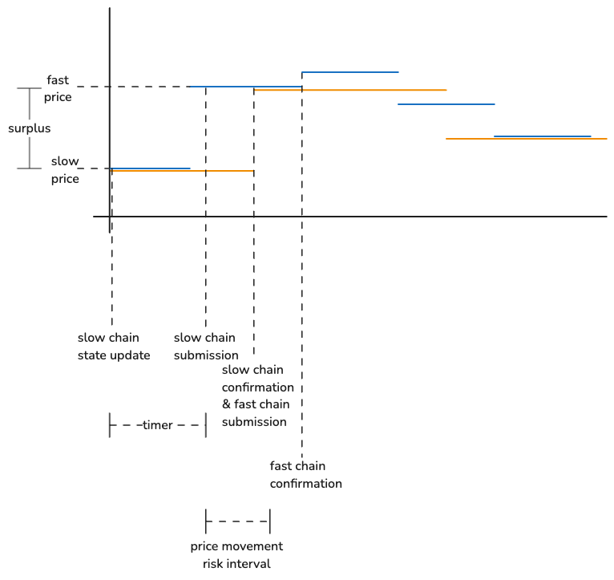
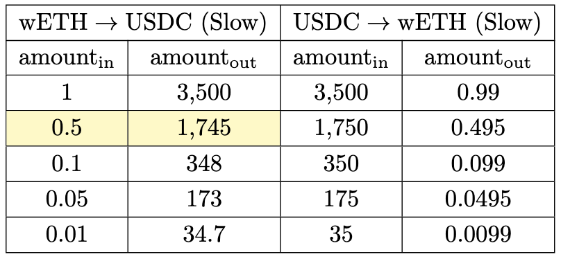
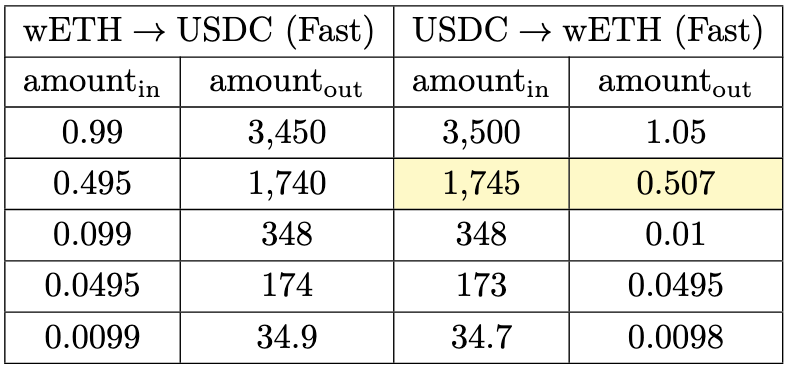
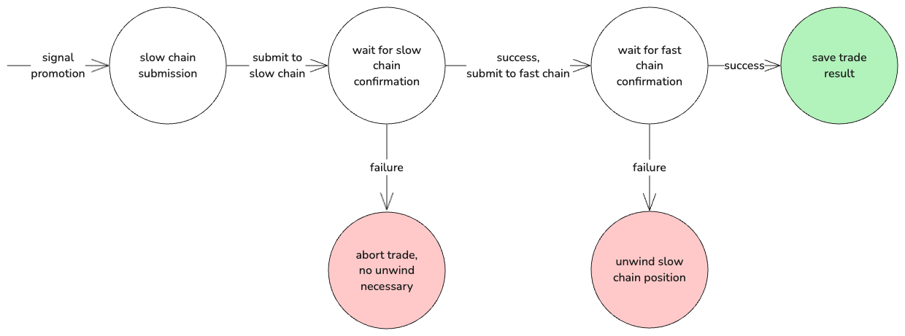
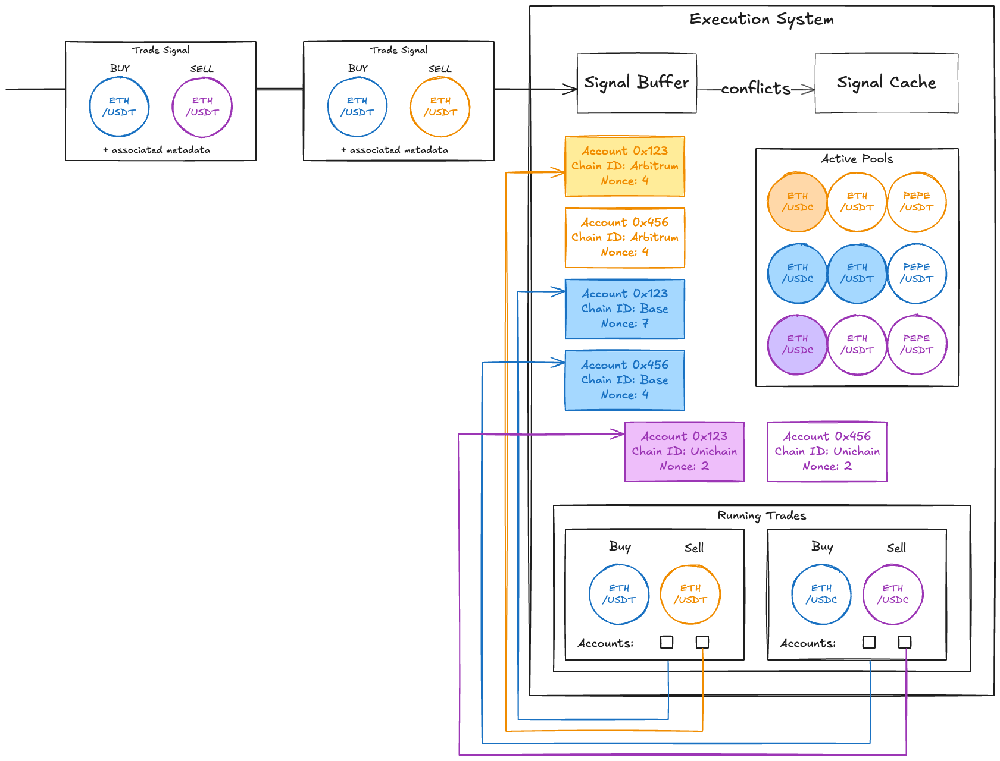

# TAP 6 - Cross Chain Arbitrage Bot
by Itamar Reif, Vedartham Bharath & Ido Geffen

# High Level Implementation Strategy


This document describes the design of a cross-chain (specifically, EVM-based rollups) arbitrage bot. At a high level, the design consists of a pipeline with three parts:
1. **Block Update Ingestion:**  We use Tycho Simulation’s `ProtocolStream` functionality to create and reap individual data streams per `(chain, token pair)` item. For simplicity, we intend to only consider single hop swaps, for which it is enough to simply consider pools which consist of the given token pair, rather than computing paths across different asset pairs.
2. **Strategies & Signal Generation:** Based on the latest pool states we generate trade signals from identified trade surpluses. Signals account for slippage as well as risk factors like congestion and settlement times using configurable discount policies. Signals will contain the expected profit based on the identified surplus and configured risk parameters, as well as the transaction payloads required to execute the trade.
3. **Trade Execution:** The trade execution system will process newly generated signals, promoting them for execution. Trades are executed sequentially, first submitting transactions and verifying their successful execution on the slower chain before processing the faster leg of the arbitrage. This is done in order to reduce the settlement risk that results from different block times (i.e. a better price might become available on the faster chain after that leg is executed, while the transaction on the slower chain is still awaiting execution).

# Block Update Ingestion

Pool data is ingested into the pipeline via a stream for each uniquely identifying tuple of `(Chain ID, Asset Pair)`, e.g. `(Base, wETH/USDC)`.
We use Tycho’s Simulation tool, specifically the protocol stream functionality, to process updates for all the relevant tokens and pools on any given chain. The streams output `BlockUpdate` objects, which contain the new block state (`ProtocolSim` trait implementer) as well as a list of new and removed pools.
- *Note:* While the Simulation tool’s stream functionality multiplexes all updates for a given chain/rollup into one protocol stream corresponding to the Websocket connection to the chain’s node, we differentiate updates according to the identifying metadata above as they are propagated throughout the rest of the pipeline.
As `BlockUpdate` objects are reaped from the stream, we apply the TVL `ComponentFilter`. We check the `BlockUpdate.new_pairs` and `BlockUpdate.removed_pairs` fields for any new and removed pairs and aggregate according to the relevant token. Pool additions, removals, and the updated state are passed down the pipeline to the relevant `Strategy`s via a broadcast channel.

#### Resources
1. [Tycho Simulation docs](https://docs.propellerheads.xyz/tycho/for-solvers/simulation)
2. [Tycho Simulation’s ProtocolSim trait definition](https://github.com/propeller-heads/tycho-simulation/blob/e588151d25a6d8070f7813b4ea8608329d221ab2/src/protocol/state.rs#L66)
3. [Tycho Client’s TVL ComponentFilter functionality](https://github.com/propeller-heads/tycho-indexer/blob/main/tycho-client/src/feed/component_tracker.rs#L55)
4. [Tycho Simulation’s BlockUpdate object definition](https://github.com/propeller-heads/tycho-simulation/blob/e588151d25a6d8070f7813b4ea8608329d221ab2/src/protocol/models.rs#L169)
5. [Tycho Simulation’s ProtocolComponent object ](https://github.com/propeller-heads/tycho-simulation/blob/e588151d25a6d8070f7813b4ea8608329d221ab2/src/protocol/models.rs#L44)definition

# Strategies

Strategies encapsulate the core processing logic in the pipeline, with each strategy being uniquely identified by a pair of (Chain ID, Asset Pair) tuples corresponding to the input data streams, e.g.:
- `(Base, wETH/USDC)`
- `(Arbitrum, wETH/USDC)`

Strategies consume the corresponding input data streams for the latest pool information from AMM pools. They calculate potential trade surpluses, incorporating risk factors and gas costs to determine expected profit. Trade signals are generated, containing all the necessary information for execution by the trade execution system.
Signals are the central data structure for representing potential trades. They provide an abstraction that encapsulates all the necessary information for a trade to be executed. A signal undergoes two key phases: generation by a strategy and promotion to execution by the execution subsystem.

Strategies are responsible for generating signals within their signal generation loops. Generated signals contain the following:
1. The strategy’s unique identifying metadata, i.e. the pair of `(Chain ID, Asset Pair, Pool IDs)` tuples.
2. Information derived during the strategy's analysis, such as:
    1. Trade surplus calculated by the strategy
    2. Risk parameter values applied to the surplus
    3. The resulting expected profit of the trade
3. Any metadata that would be required by the trade execution subsystem if the signal is promoted for execution, such as:
    1. Metadata and calldata for creating the transactions
    2. Expiration timestamp and block numbers corresponding to each chain
    3. Signer accounts for corresponding chains
    4. Node information for corresponding chains

Subsequently, the trade execution system takes over, responsible for evaluating and promoting suitable generated signals for on-chain execution.

## Signal Generation
Generating trade signals is the core function of each `Strategy`. To generate these signals, each `Strategy`’s logic will follow a loop that fundamentally relies on sequential execution, first on the slower chain and then on the faster chain:
1. Slow Chain State Update: Upon receiving a state update for the slower chain, we process the slow chain state update and set up a timer for submission:
    1. Signal Timer: This timer introduces a delay, which is crucial for ensuring that the fast chain data used in later calculations is as up-to-date as possible. Since the fast chain's block state might become outdated by the time transactions are submitted, we want to wait until relatively late in the slow chain's block before generating the signal using the fast chain’s state.
    2. Simulate Swap Values: To optimize for the subsequent steps, immediately upon receiving the slow chain’s `BlockUpdate` we precalculate a table of `amount_in, amount_out` pairs for the slow chain. These values will be used as inputs for simulating swaps the fast chain once the timer expires.
2. Fast Chain State Update: Upon receiving the fast chain’s `BlockUpdate`, we calculate optimal swap amounts to determine available surplus, and thus swap direction and expected profit for the signal.
    1. Calculate Optimal Swap: Using the precomputed swap table for the slow chain as inputs (i.e. the `amount_out` values as `amount_in` and vice versa), we calculate the fast chain’s side of the trade. Using both chains’ swap tables we determine the optimal swap amount using a binary search over the calculated surplus in each direction (i.e. sell on slow and buy on fast vs buy on slow and sell on fast).
    2. Calculate Expected Profit: The optimal swap amounts are then discounted  to account for congestion and settlement failure risks (i.e. another trade is executed in the block first) and gas costs are deducted to compute the expected profit of the signal.
3. Signal Generation: Once the timer expires (and no calculation is taking place) we emit a signal object to the trade execution system’s signal buffer, from which it can be promoted for execution.

The `Strategy` will iterate over this logic for each block of the slow chain, precalculating the `(amount_in, amount_out)` values on the slower chain as soon as the slow chain’s block update arrives and start the timer. As several blocks can occur on the faster chain during one block on the slow chain, we wait for the timer to expire before generating the trade signal. The optimal swap, surplus, and expected profit values are computed on arrival of the fast block however, in order to make sure that the signal is ready as soon as possible. See the diagram below for an example:


### Computing Trade Surplus & Optimal Swap Size
In order to compute the surplus of a pair of trades in a cross-chain arbitrage, we simulate the swap on the slow chain for a given amount and use the `amount_out` as the `amount_in` on the fast chain, taking the difference between the `amount_in` on the slow chain and the `amount_out` on the fast chain. For example, if we sell asset A for asset B on the slow chain and then sell B for A on the fast chain, our surplus (denominated in asset A) would be:

\begin{align*}
\mathrm{surplus}^A :=
    &   \bigl(-\mathrm{in}^{A}_{\text{slow}} +\mathrm{out}^{B}_{\text{slow}}\bigr)
        + \bigl(-\mathrm{in}^{B}_{\text{fast}} +\mathrm{out}^{A}_{\text{fast}}\bigr) \\
    =&  \bigl(\mathrm{out}^{B}_{\text{slow}} - \mathrm{in}^{B}_{\text{fast}}\bigr)
        + \bigl(\mathrm{out}^{A}_{\text{fast}} -\mathrm{in}^{A}_{\text{slow}}\bigr) \\
    =&  \bigl(\mathrm{out}^{A}_{\text{fast}} -\mathrm{in}^{A}_{\text{slow}}\bigr)
\end{align*}

Where the intermediate B amounts cancel out since we set the second leg’s input parameter as:

\begin{equation*}
    \mathrm{in}^B_{\text{fast}} := \mathrm{out}^B_{\text{slow}}
\end{equation*}

Similarly for the other direction, i.e. if we sell B for A on the slow chain and then sell A for B on the fast chain, we would have:

\begin{align*}
\mathrm{surplus}^B :=
    &   \bigl(-\mathrm{in}^{B}_{\text{slow}} +\mathrm{out}^{A}_{\text{slow}}\bigr)
        + \bigl(-\mathrm{in}^{A}_{\text{fast}} +\mathrm{out}^{B}_{\text{fast}}\bigr) \\
    =&  \bigl(\mathrm{out}^{A}_{\text{slow}} - \mathrm{in}^{A}_{\text{fast}}\bigr)
        + \bigl(\mathrm{out}^{B}_{\text{fast}} -\mathrm{in}^{B}_{\text{slow}}\bigr) \\
    =&  \bigl(\mathrm{out}^{A}_{\text{fast}} -\mathrm{in}^{B}_{\text{slow}}\bigr)
\end{align*}

Again, the intermediate A amounts cancel out since we set the second leg’s input parameter as:

\begin{equation*}
    \mathrm{in}^A_{\text{fast}} := \mathrm{out}^A_{\text{slow}}
\end{equation*}

In order to determine the trade direction and the optimal amount to swap, we perform a binary search over surplus values with boundary values of 0 and the minimum between our available inventory on each chain or the max trade amount supported by the pool.
Thanks to sequential execution, we can speed up this process by calculating the table of `amount_in` and `amount_out` values for both each asset (and each pool) on the slow chain before receiving the new block for the fast chain. Once the fast chain’s block arrives, we then use the precomputed `amount_out` from the slow chain as swap inputs for the other side of the trade. For example, we would compute the following table for the slow chain:



Once the fast chain’s block update arrives, we then use the `amount_out` column for each asset to calculate the surplus corresponding to that swap, and choose the optimal amount using a binary search.



### Expected Profit and Discounting for Risk
While the calculation described in the previous section provides the “raw” amount of tokens extracted from both legs of the arbitrage, we must take into account cost and discount factors like slippage, gas cost, and congestion-related settlement risk.
To account for slippage, we provide a configuration value that provides a constant slippage adjustment in bps. We multiply the `amount_out` values we receive from the simulation outputs to account for slippage, adjusting the surplus formula above as follows:

\begin{align*}
\mathrm{E}\left[\pi^A \mid \text{slippage}, \text{gas}\right]
  := &
        \bigl[-\mathrm{in}^{A}_{\text{slow}}
             +\mathrm{out}^{B}_{\text{slow}} \cdot (1-\text{slip})\bigr]
        + \bigl[-\mathrm{in}^{B}_{\text{fast}}
             +\mathrm{out}^{A}_{\text{fast}} \cdot (1-\text{slip}) \bigr] \\
  &     - (gas_{\text{slow}} + gas_{\text{fast}}) \\
  =&    \bigl[-\mathrm{in}^{A}_{\text{slow}}
             +\mathrm{out}^{A}_{\text{fast}} \cdot (1-\text{slip}) \bigr]
             + \bigl[-\mathrm{in}^{B}_{\text{fast}}
             +\mathrm{out}^{B}_{\text{slow}} \cdot (1-\text{slip})\bigr] \\
  &     - (gas_{\text{slow}} + gas_{\text{fast}}) \\
  =&    \bigl[-\mathrm{in}^{A}_{\text{slow}}
             +\mathrm{out}^{A}_{\text{fast}} \cdot (1-\text{slip}) \bigr]
        - (gas_{\text{slow}} + gas_{\text{fast}}) \\
\end{align*}

This assumes a “worst case” execution, i.e. that our trades are filled at the maximum slippage tolerance. Just like before, we set the second leg’s input parameter such that the intermediate B amounts cancel out.

\begin{equation*}
    \mathrm{in}^B_{\text{fast}} := \mathrm{out}^B_{\text{slow}} \cdot (1-\text{slip})
\end{equation*}

However, since we assume worst-case execution here, a small amount of B tokens remains as additional profit on the slow chain’s leg of the arbitrage (and similarly, a small amount of extra A tokens on the fast chain).

#### Resources
1. [Slippage adjustment example from Tycho Quickstart documentation](https://docs.propellerheads.xyz/tycho#b.-create-a-solution-object)

### Congestion & Settlement Risk
Since we are executing each leg of the arbitrage on a different chain rather than atomically closing out cycles on a single ledger, there is a risk that one leg fails independently from the other.
The main settlement failure of interest to us results from congestion in accessing a given pool. That is, when multiple transactions trade against the same pool the order of inclusion can impact the execution price. The first transaction to swap against the pool in a given block will enjoy the same execution environment as the simulation, but subsequent transactions will execute against the modified state. This introduces an element of risk, causing either a partial swap to execute or the transaction to fail entirely, depending on the transaction’s slippage parameters. We label the congestion risk for a given chain C as $\rho_C$.

Since the trade relies on both legs executing successfully, we assume the risks compound and thus account for it by multiplying the expected profit (calculated above) by both chains’ discount factors:

\begin{equation*}
\mathrm{E}\left[\pi^A \mid \text{slippage}, \text{gas},
    \rho_{\text{slow}},     \rho_{\text{fast}}\right] =
\mathrm{E}\left[\pi^A \mid \text{slippage}, \text{gas}\right] \cdot
    \rho_{\text{slow}} \cdot \rho_{\text{fast}}
\end{equation*}


We will initially support a constant discount factor for each chain, provided via config. As development matures, we intend to examine support for the following solutions:
1. TCP/IP-inspired additive increase/multiplicative decrease adjustment mechanism for dynamic adjustment based on settlement failure on each chain.
2. Priority fee payments based on a transaction’s expected profit, depending on support in different chains’ blockspace markets.

#### Resources
1. [Wikipedia: AIMD](https://en.wikipedia.org/wiki/Additive_increase/multiplicative_decrease)

# Trade Execution


Multiple strategies generate signals in parallel, and the trade execution engine needs to decide which ones to promote for execution. Signals are reaped by the trade execution system as long as they haven’t expired and do not conflict with any running trades. If multiple conflicting signals are reaped at the same time, the one with the highest expected profit is chosen for promotion.
When signals are promoted, their attached metadata (calldata, expiration, etc.) is used to create the required transactions. Nonces corresponding to each chain are attached by the trade execution system which manages them, and the keys are used to sign the transactions.
The prepared transactions are then sequentially executed: the first leg is submitted to the slower chain and after execution confirmation is received the second leg is submitted to the faster one. Sequential execution aims to reduce the failure of a trade due to mismatched block times, congestion and demand for blockspace across different chains.
We use Tycho Execution’s encoding and execution functionality to prepare transactions and submit them to the Tycho Router for execution.

#### Resources
1. [Tycho Execution’s encoding documentation](https://docs.propellerheads.xyz/tycho/for-solvers/execution/encoding)
2. [Tycho Router source code](https://github.com/propeller-heads/tycho-execution/blob/main/foundry/src/TychoRouter.sol#L68)

## Signal Promotion


Generated signals are ingested by the trade execution system via a buffer. Signals are considered for promotion on two different triggers:
1. When a signal arrives in the buffer, it is checked for conflicts and promoted to execution if none exist.
    - If a conflict exists, the signal is added to the cache and will be promoted once the conflict is resolved or dropped once it expires.
    - If multiple signals are reaped from the buffer and are in conflict, we break ties using the expected profit associated with each.

2. When a trade completes, we check both the cache and signal buffer for conflicts and expiration, then try to promote any unexpired signals corresponding to the pools and accounts in the completed trade.

When a signal is promoted for execution, the corresponding pools and accounts are marked as active. This information is used when processing signals for promotion to check for the following conflicts:
- Different trades may execute against the same pools, changing the available liquidity and thus execution prices. We block the signals corresponding to pools that have trades currently being executed against them from promotion in order to prevent race conditions.
- Different trades may use the same account on the same chain, causing nonce conflicts.

The target block provided for the signal is also checked against the current state for expiration and expired signals are dropped.

## Encoding Calldata & Account Management
In order to execute promoted signals as quickly as possible, signals are populated with the encoded calldata for transaction submission when they are generated, rather than when they are promoted.
However, since promotion for execution depends on running trades, we don’t know what the latest nonce for the given account will be until it is promoted. Promotion thus also requires signing the final transaction object as well as any required permits or approvals (such as `Permit2` or for the target block mechanism).
The execution system maintains several accounts and their associated nonces, incrementing the locally cached nonce by 1 upon successful transaction submission. Submissions that return an invalid nonce error cause a nonce refetch, after which the transaction is signed again and another submission is attempted.

## Trade Result Handling
Sequentially executed trades can end in several states:
1. Successful trade
2. Transaction was not included in the block for either the slower or the faster chain.
3. Included but reverted transactions (e.g. slippage tolerance was exhausted) on either the slower or the faster chain

The happy path simply frees up the associated pools and accounts in the trade execution system, increments the locally cached nonces and saves metadata to disk for monitoring and accounting purposes. The saved metadata includes:
1. Signal information, such as expected profit, inputs, and risk parameters.
2. Realized profit, gas cost, etc.
3. Executed transaction hashes, block heights, etc.

The available inventory is updated as well, to be accessed by strategies during signal generation.

### Handling Failed Trades
In order to ensure tight tolerances for inclusion failures, we institute a target block mechanism with a 1-block expiration, providing for safer cancellation of a trade.
In the case of an intermediate failure, i.e. in the first, “slower leg” of the trade, either because the transaction reverts or isn’t included, we can simply avoid submitting the faster leg of the trade. The target block mechanism ensures quick (single block) feedback without requiring complicated nonce replacement-style cancellation logic, as failure can simply be observed by checking the next block. This can be enforced with a simple Solidity contract (gas optimizations likely out of scope for this proposal):

```solidity
// SPDX-License-Identifier: MIT
pragma solidity ^0.8.24;

contract TargetBlock {
    // owner is set once at deployment
    address public immutable owner;

    constructor(address _owner) {
        owner = _owner;                // no zero-address guard per request
    }

    modifier onlyOwner() {
        require(msg.sender == owner, "not owner");
        _;
    }

    /**
     * @notice Forward arbitrary calldata to a target contract
     *         so long as the tx is mined on or before `deadline`.
     * @param target   Contract to call.
     * @param data     Calldata to forward.
     * @param deadline Last block in which this call is valid.
     */
    function execute(
        address target,
        bytes calldata data,
        uint256 deadline
    ) external onlyOwner returns (bytes memory result) {
        require(block.number <= deadline, "deadline passed");

        (bool ok, bytes memory ret) = target.call(data);
        require(ok, "call failed");
        return ret;
    }
}
```

Failures in the second, “fast leg” require unwinding the position on the slower chain. Since this is likely to result in losses, as failures usually occur during volatile periods with high congestion, sequential execution of the trade reduces expected losses by entirely avoiding a situation where the “fast leg” succeeds but the “slow leg” fails, requiring us to unwind positions on the faster chain.
